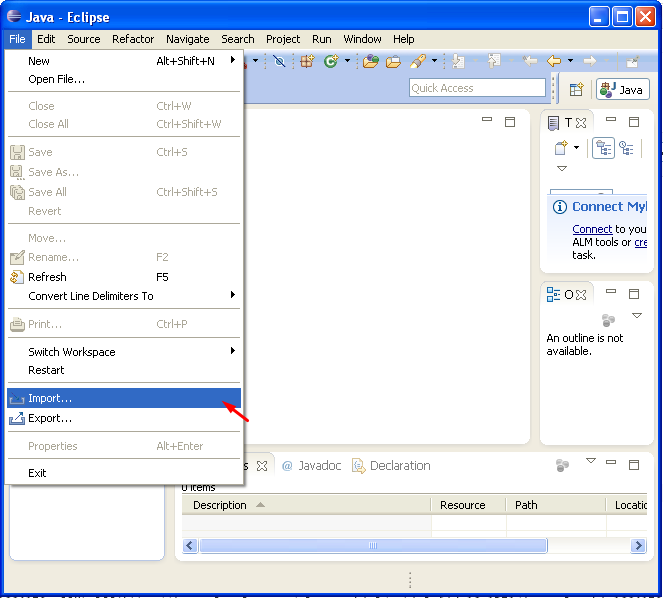
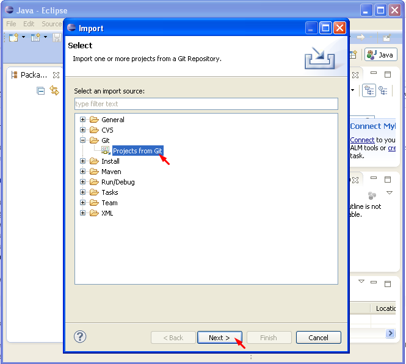
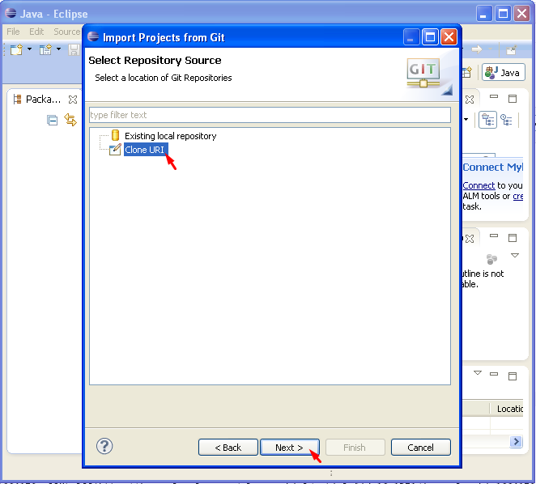
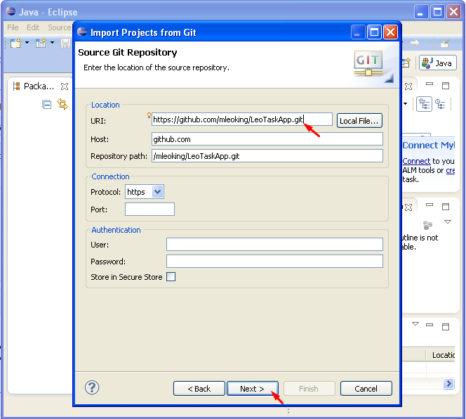
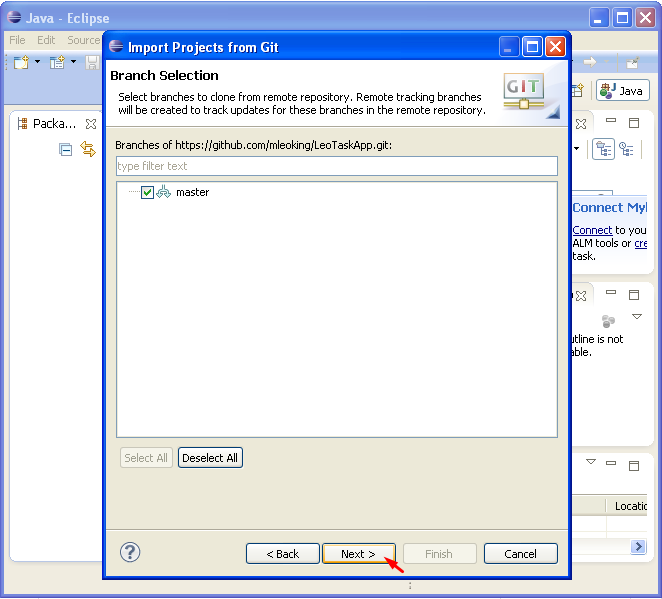
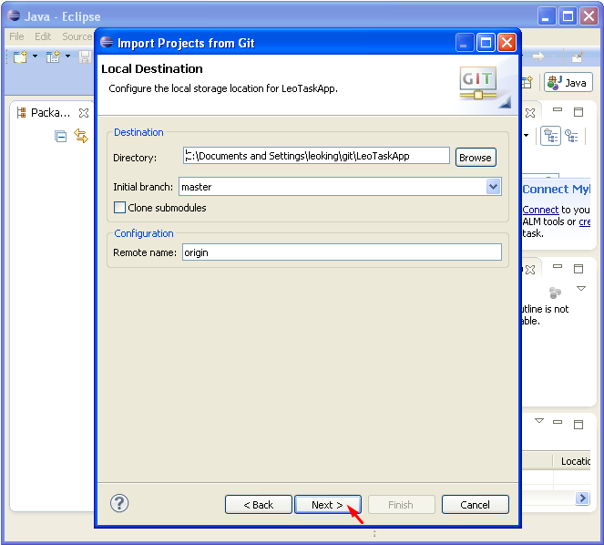
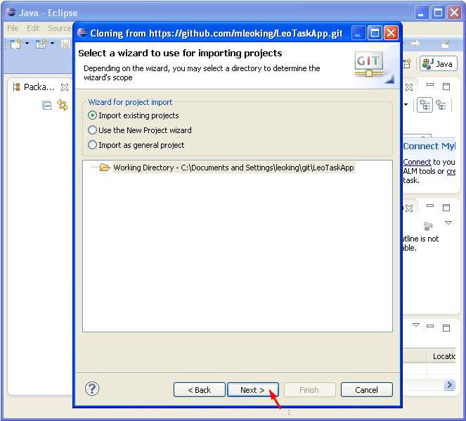
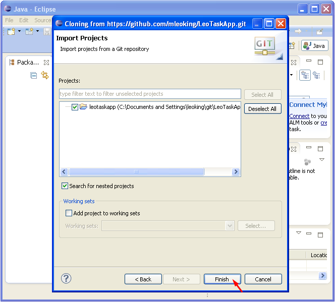

## Import the projects into your local Eclipse workspace

For the LeoTaskApp project, the URI is https://github.com/mleoking/LeoTaskApp.git

For the LeoTask project, the URI is https://github.com/mleoking/LeoTask.git

